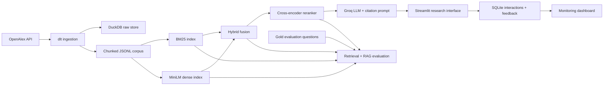

# Evidence Gap Navigator

[**Live demo: Evidence Gap Navigator**](https://evidence-gap-navigator.streamlit.app/)

Evidence Gap Navigator is a retrieval-evaluated RAG application for researchers and AI
engineers who need to understand what the scholarly literature says about evaluating and
monitoring retrieval-augmented generation systems.

The application does not answer from general model memory. It searches a public OpenAlex
knowledge base, retrieves relevant evidence, synthesizes an answer with source citations,
and explicitly separates findings, methodological limitations, and open research gaps.

> **K-R&D Lab location:** `SPHERE III -> T3 Dashboards, Interfaces & Open Infrastructure -> T3-R3 -> R3a Evidence Gap Navigator`.
>
> This is a full working research-tool module inside `SPHERE-III-TECHNOLOGY`, not a separate lab repository.

## Problem

RAG evaluation is fragmented across retrieval metrics, answer-quality metrics, benchmark
design, production monitoring, and domain-specific studies. A practitioner trying to answer
questions such as “Which metrics expose retrieval failure?” or “How should retrieval drift be
monitored?” must search many papers and still reconcile incompatible terminology.

Evidence Gap Navigator provides a focused evidence interface for this task:

- **User:** AI engineer, evaluator, or applied researcher.
- **Need:** find and compare evidence on RAG evaluation and monitoring.
- **Knowledge base:** public scholarly metadata and abstracts retrieved from OpenAlex.
- **Useful answer:** a concise synthesis with clickable citations, limitations, and research gaps.
- **Success test:** relevant source works are retrieved and the generated answer stays grounded in them.

## Architecture



## Implemented flow

1. `dlt` fetches public works from OpenAlex and stores normalized records in DuckDB.
2. Abstracts are transformed into shareable evidence chunks with source metadata.
3. Four retrieval configurations are evaluated: BM25, dense vector, hybrid, and hybrid with
   cross-encoder reranking.
4. The best evaluated retrieval method supplies evidence to the LLM.
5. Two answer prompts are evaluated; the strongest measured version is the application default.
6. Streamlit exposes the assistant, evidence explorer, evaluation results, and monitoring.
7. User interactions, latency, citation coverage, and explicit feedback are stored in SQLite.

## Evaluation

### Retrieval evaluation

The committed gold set in `data/evaluation/questions.json` maps realistic research questions
to relevant OpenAlex work IDs. `scripts/evaluate_retrieval.py` compares:

- BM25 keyword search
- MiniLM dense semantic search
- weighted hybrid search
- hybrid search with cross-encoder reranking

Metrics: Hit Rate@5, Hit Rate@10, MRR@10, and nDCG@10. Generated result tables are committed
under `artifacts/evaluation/` so reviewers can inspect them without rerunning model downloads.

| Method | Hit Rate@5 | Hit Rate@10 | MRR@10 | nDCG@10 |
| --- | ---: | ---: | ---: | ---: |
| BM25 | 0.625 | 0.750 | 0.405 | 0.399 |
| Dense | 0.750 | 0.813 | 0.646 | 0.560 |
| Hybrid | **0.938** | **1.000** | 0.629 | **0.606** |
| Hybrid + reranker | 0.813 | 0.875 | **0.683** | 0.557 |

The application default is **hybrid + reranker** because it achieves the highest MRR@10, placing a
relevant work earlier for a research question. Plain hybrid remains visible in the interface because it
achieves the strongest coverage and nDCG in this corpus.

### End-to-end RAG evaluation

`scripts/evaluate_rag.py` compares two prompt strategies on groundedness, relevance,
completeness, and citation quality. A strict LLM judge scores each answer from 1 to 5 against
reference notes. The highest-scoring prompt is used by default.

| Prompt | Groundedness | Relevance | Completeness | Citation quality | Overall |
| --- | ---: | ---: | ---: | ---: | ---: |
| v1 | 1.50 | 2.50 | 1.75 | 1.75 | 1.875 |
| v2 | **2.50** | **3.25** | **2.50** | **2.75** | **2.750** |

Prompt **v2** is the application default. It requires a structured evidence synthesis, explicit caveats,
and research gaps; it scored higher on the same four-question evaluation slice.

## Data

- Source: [OpenAlex Works API](https://docs.openalex.org/api-entities/works)
- Topic query: `retrieval augmented generation`
- Coverage: works from 2020 onward with public abstracts
- Raw data can be regenerated; the processed JSONL corpus and dense index are committed for reproducibility
- No DataTalks.Club FAQ or course dataset is used

OpenAlex metadata is provided under CC0. Individual linked works may have their own access and
licensing conditions; this repository stores metadata and abstracts returned by the API.

## Interface

The Streamlit app contains five reviewer-facing areas:

- **Ask:** citation-grounded RAG answers and explicit feedback controls
- **Explore evidence:** direct inspection of retrieved scholarly records
- **Evaluation:** committed retrieval and end-to-end comparison tables
- **Monitoring:** at least five usage and quality charts
- **Method:** concise explanation of the full pipeline

Without `GROQ_API_KEY`, the interface remains usable in transparent retrieval-preview mode.
With a key, it generates full evidence-backed answers.

## Quick start

### Option A: local Python

Requirements: Python 3.11 or 3.12.

```bash
git clone https://github.com/K-RnD-Lab/SPHERE-III-TECHNOLOGY.git
cd "SPHERE-III-TECHNOLOGY/T3 - Dashboards, Interfaces & Open Infrastructure/T3-R3 - Evidence Gap Navigator/R3a-evidence-gap-navigator"
python -m venv .venv

# Windows PowerShell
.venv\Scripts\Activate.ps1

# macOS/Linux
source .venv/bin/activate

pip install --upgrade pip
pip install -e ".[dev]"
cp .env.example .env
```

Add a free Groq key to `.env` for LLM answers:

```dotenv
GROQ_API_KEY=your_key_here
```

The processed corpus and index are committed, so the app can start immediately:

```bash
streamlit run app.py
```

Open `http://localhost:8501`.

### Option B: Docker Compose

```bash
cp .env.example .env
docker compose up --build app
```

Everything required by the application runs in the Compose service. The monitoring database
uses a persistent Docker volume.

### Option C: Streamlit Community Cloud

Create a new app from `K-RnD-Lab/SPHERE-III-TECHNOLOGY`, choose `main`, and set the main file to
`T3 - Dashboards, Interfaces & Open Infrastructure/T3-R3 - Evidence Gap Navigator/R3a-evidence-gap-navigator/app.py`.
The committed corpus and dense index let the deployed app start without a separate ingestion job.
For generated answers, add this secret in the Streamlit app settings; do not commit it:

```toml
GROQ_API_KEY = "your_key_here"
```

Without the secret, the public deployment remains available in transparent retrieval-preview mode.

## Rebuild data and evaluations

```bash
# Automated OpenAlex ingestion with dlt + dense index build
python scripts/ingest.py --max-works 240 --force-index

# Compare all retrieval approaches
python scripts/evaluate_retrieval.py

# Compare LLM prompt approaches (requires GROQ_API_KEY)
python scripts/evaluate_rag.py

# Verify
pytest -q
ruff check .
```

The same tasks are available through Docker Compose:

```bash
docker compose --profile tools run --rm ingest
docker compose --profile tools run --rm evaluate
```

## Configuration

| Variable | Required | Default | Purpose |
|---|---:|---|---|
| `GROQ_API_KEY` | For LLM answers | empty | Groq API credential |
| `LLM_PROVIDER` | No | `groq` | Documented provider selector |
| `LLM_MODEL` | No | `qwen/qwen3.6-27b` | Chat model (`openai/gpt-oss-20b` is a compatible optional override) |
| `JUDGE_MODEL` | No | `qwen/qwen3.6-27b` | Model used only by LLM evaluation |
| `OPENALEX_EMAIL` | No | empty | Polite-pool contact for OpenAlex |
| `OPENALEX_QUERY` | No | project topic | Corpus query |
| `MONITORING_DB` | No | `data/monitoring.db` | SQLite monitoring path |

## Project rubric map

| Criterion | Evidence |
|---|---|
| Problem description | Concrete user, research problem, evidence source, and quality definition above |
| Retrieval flow | OpenAlex knowledge base + BM25/dense/hybrid retrieval + Groq answer generation |
| Retrieval evaluation | Four approaches compared with Hit Rate, MRR, and nDCG |
| LLM evaluation | Two prompt strategies compared with four end-to-end quality dimensions |
| Interface | Streamlit application with assistant, explorer, evaluation, and monitoring |
| Ingestion pipeline | Automated `dlt` ingestion into DuckDB and searchable corpus |
| Monitoring | Feedback collection plus 5+ monitoring charts |
| Containerization | Full application and tool tasks defined in Docker Compose |
| Reproducibility | Public data snapshot, pinned dependency ranges, setup commands, tests |
| Best practices | Hybrid search, document reranking, optional query rewriting |
| Bonus | Cloud deployment configuration is included when a public URL is available |

## Repository structure

```text
evidence-gap-navigator/
├── app.py
├── src/evidence_gap_navigator/
│   ├── ingestion.py
│   ├── retrieval.py
│   ├── rag.py
│   ├── evaluation.py
│   └── monitoring.py
├── scripts/
│   ├── ingest.py
│   ├── evaluate_retrieval.py
│   └── evaluate_rag.py
├── data/
│   ├── processed/documents.jsonl
│   └── evaluation/questions.json
├── artifacts/
│   ├── index/
│   └── evaluation/
├── tests/
├── Dockerfile
└── docker-compose.yml
```

## Limitations

- Abstracts are evidence summaries, not substitutes for reading full papers.
- OpenAlex coverage and abstract availability vary by publisher.
- LLM-as-judge scores are comparative signals, not absolute scientific validation.
- The corpus is intentionally scoped to RAG evaluation and monitoring; broad AI questions are out of scope.

## License and citation

Code is released under the MIT License. Citation metadata is available in `CITATION.cff`.
